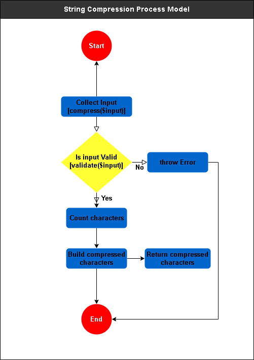
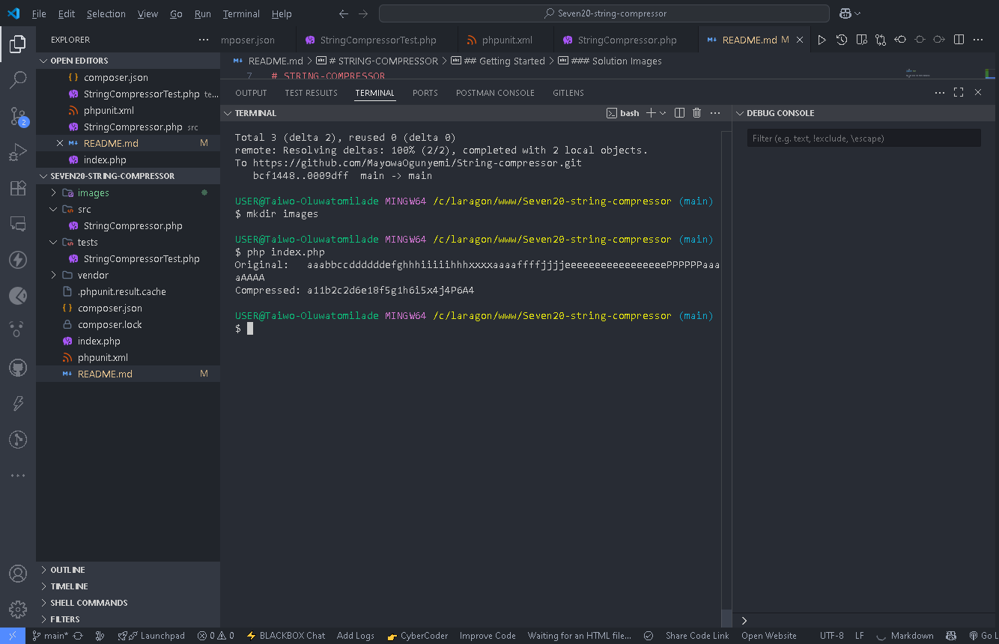

<div id="top">

<!-- HEADER STYLE: CLASSIC -->
<div align="center">


# STRING-COMPRESSOR

<em>Transform Data, Unlock Efficiency, Compress with Confidence</em>

<!-- BADGES -->


<em>Built with the tools and technologies:</em>


</div>
<br>

---

## Table of Contents

- [STRING-COMPRESSOR](#string-compressor)
  - [Table of Contents](#table-of-contents)
  - [Overview](#overview)
    - [Features](#features)
  - [Getting Started](#getting-started)
    - [Prerequisites](#prerequisites)
    - [Installation](#installation)
    - [Usage](#usage)
    - [Testing](#testing)
    - [Architecture](#architecture)
    - [Solution Images](#solution-images)

---

## Overview

String-compressor is a lightweight, PSR-4-compliant PHP utility that compresses strings by aggregating character occurrences, regardless of their positions (non-consecutive). Built with modular design principles and test-driven development (TDD) in mind.

### Features

The core features include:
- Compresses any string by counting the number of times each character appears
- Maintains the order of first appearance
- Designed following SOLID principles and clean architecture
- Fully unit-tested with PHPUnit. Ensures code quality and stability
- Ready for extension and integration into other applications

---

## Getting Started

### Prerequisites

This project requires the following dependencies:

- **Programming Language:** PHP
- **Package Manager:** Composer
- **Test framework:** PHPUnit ^12.2 (for running tests)

### Installation

Clone the repository and install dependencies via [Composer](https://getcomposer.org):

1. **Clone the repository:**

    ```sh
    ❯ git clone https://github.com/MayowaOgunyemi/String-compressor
    ```

2. **Navigate to the project directory:**

    ```sh
    ❯ cd String-compressor
    ```

3. **Install the dependencies:**

**Using [composer](https://www.php.net/):**

```sh
❯ composer install
```

### Usage

Run the project in the terminal with:

**Using [composer](https://www.php.net/):**

```sh
php index.php
```
You can modify the input value to your choice within the index.php file

### Testing

`String-compressor` uses the **PHPUnit** test framework to write unit tests and it covers various edge cases. 
**Example test cases:**
- ✅ Normal input compression
- ✅ Repeated characters
- ✅ Mixed characters
- ✅ Empty string
- ✅ Whitespace-only input
- ✅ Exception handling
- ✅ Case sensitivity
- ✅ Non-alphabetic characters

Run the test suite with:

**Using [composer](https://www.php.net/):**

```sh
composer test
```

You can also run tests manually:
```sh
vendor/bin/phpunit
```

### Architecture
- Follows Single Responsibility Principle (SRP)
- Strict separation of concerns
- Error handling and input validation included
- PSR-4 autoloading enabled via Composer

### Solution Images
**Process Model:**


**Compression Exercise Demo:**



---

<div align="left"><a href="#top">⬆ Return</a></div>

---
